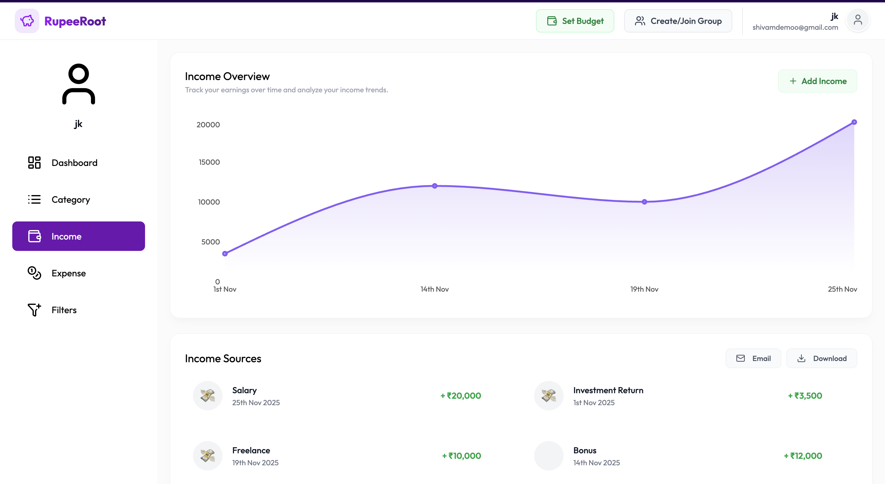
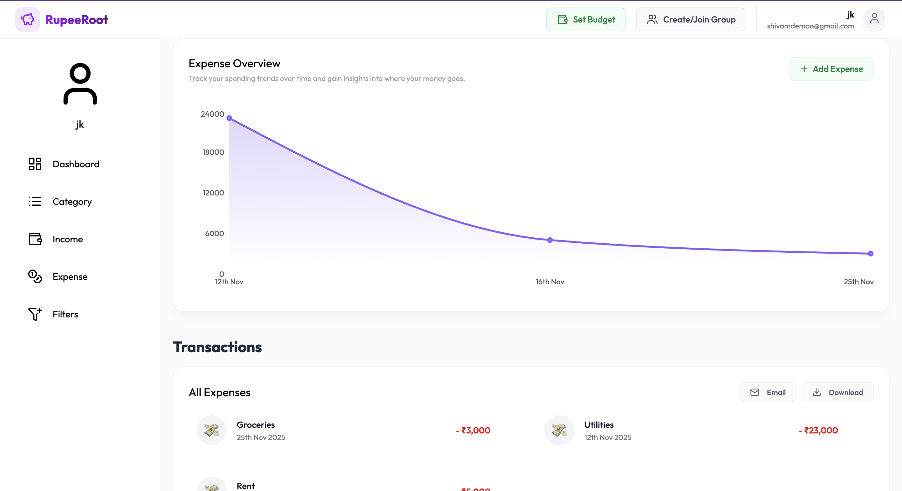
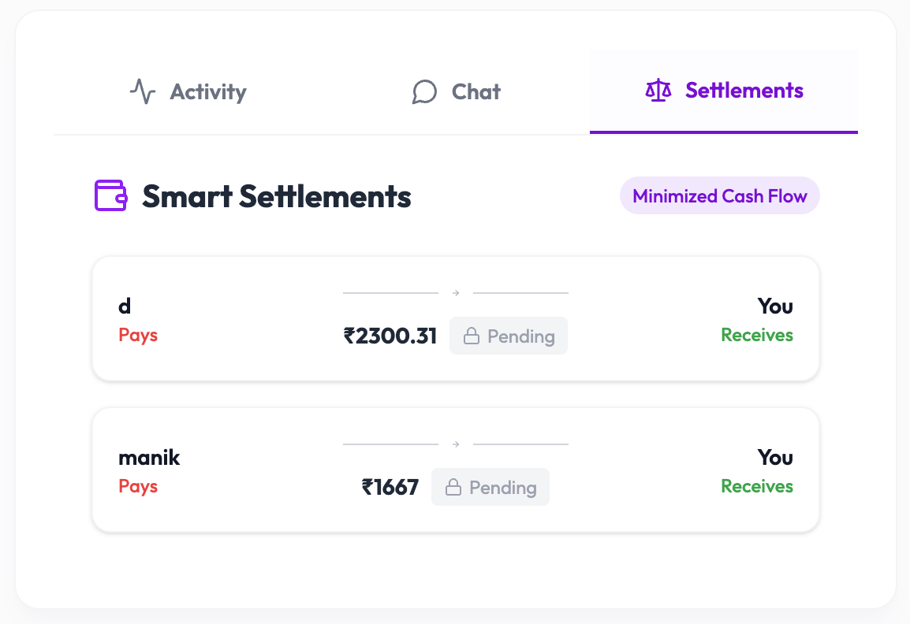
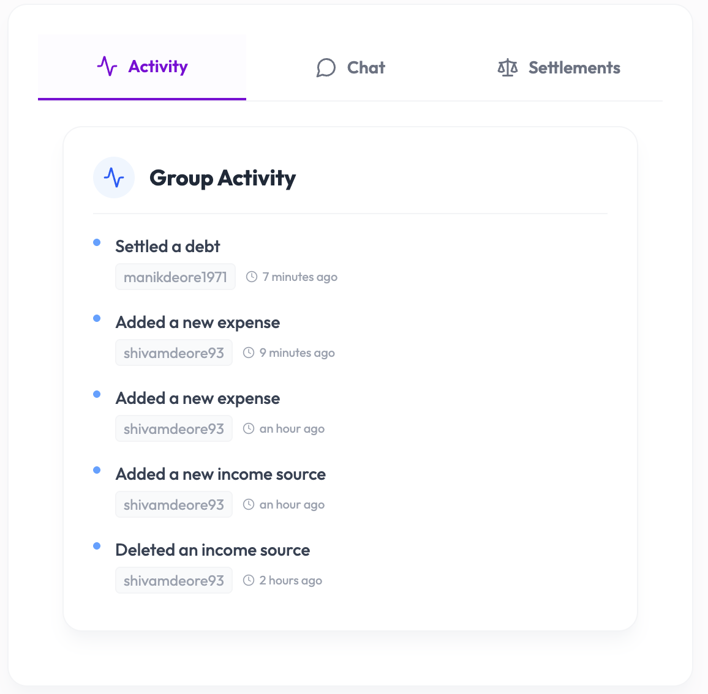
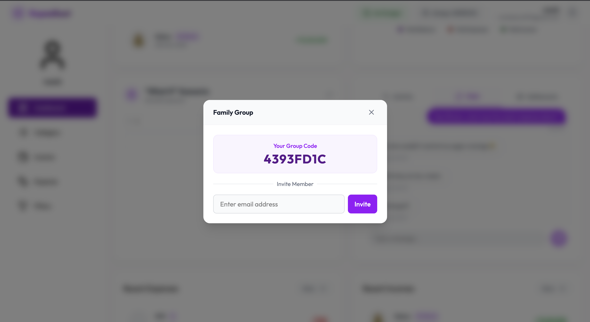

# 💰 RupeeRoot


**RupeeRoot** is an enterprise-grade financial management suite engineered with a **Microservice-ready Monolithic architecture**. It leverages **Spring Boot** and **React** to deliver a seamless full-stack experience for personal wealth tracking, complex debt settlement algorithms, and real-time collaborative group finance.

---

## 🚀 Key Features & Technical Capabilities

### 💸 Financial Analytics & Visualization

* **Real-Time Dashboard:** Interactive visualizations (Pie/Line Charts via **Recharts**) displaying income vs. expense trends.
* **Low-Latency Data Fetching:** Implemented **Redis Caching** (`@Cacheable`) to cache dashboard metrics (Total Balance, Recent Transactions), reducing DB hits by ~40% for frequent reads.
* **Granular Transaction Logging:** Custom categorization engine with dynamic **Emoji Support** for intuitive expense tracking.

### 🧠 Algorithmic Debt Settlement

* **Greedy Algorithm Implementation:** Custom **Min-Cash-Flow Algorithm** to minimize the number of settlement transactions.
* **Graph Optimization:** Cuts worst-case `N*(N-1)` transactions toward `N-1` where possible.

### ⚡ Real-Time Collaboration (WebSocket)

* **Event-Driven Architecture:** STOMP over WebSockets + SockJS fallback.
* **Persistent Chat History:** Messages persisted to MySQL for auditability and then broadcast to subscribed clients.
* **Group Invitations:** Email-based group codes via `JavaMailSender`.

### 🛠 Advanced Simulation & Reporting

* **What-If Simulator:** Forecast savings using monthly input, inflation, ROI, etc.
* **Excel Export:** `.xlsx` export using Apache POI for offline analysis.

### 🛡️ Security & Observability

* **JWT-based stateless authentication** + `JwtRequestFilter`.
* **AOP logging** (`ActivityLoggingAspect`) for tamper-evident audit trails.

---

## 🏗 Tech Stack

**Backend:** Java 17, Spring Boot 3.x, Spring Security 6, Hibernate/JPA, MySQL 8, Redis (Lettuce), Maven
**Frontend:** React 18 (Vite), Tailwind CSS, Framer Motion, Lucide React, React Router v6, Axios

---

## 🚀 Getting Started

### Prerequisites

* Java 17+
* Node.js v18+ & npm
* MySQL 8.0+
* Redis (optional)

### Backend

```bash
git clone https://github.com/ShivaScripts/Rupee-Root.git
cd Rupee-Root/backend

# Update src/main/resources/application.properties
# then build & run
./mvnw clean install
./mvnw spring-boot:run
```

### Frontend

```bash
cd ../frontend
npm install
npm run dev
```

---

## 📸 Screenshots

> **Notes:**
>
> * This gallery uses a clean table-based grid so images maintain uniform size and alignment on GitHub.
> * Each thumbnail is clickable to open the full-size image in a new tab.
> * Filenames used in repo: `docs/screenshots/dashboard.png`, `dashboard1.png`, `dashboard2.png`, `settlement.png`, `recentactivity.png`, `chat.png`, `groupinvitations.png`, `invitationmail.png`, `whatif.png`, `excel.png`.
> * Below I’ve also added two local uploads (these are included for preview inside the canvas):

**Local preview images (uploaded):**


<table align="center" width="100%" cellpadding="16">
  <tr>
    <td align="center" width="33%">
      <a href="docs/screenshots/dashboard.png" target="_blank" rel="noopener noreferrer">
        
      </a>
      <div><sub>Dashboard — Overview</sub></div>
    </td>

```
<td align="center" width="33%">
  <a href="docs/screenshots/dashboard1.png" target="_blank" rel="noopener noreferrer">
    
  </a>
  <div><sub>Dashboard — Charts</sub></div>
</td>

<td align="center" width="33%">
  <a href="docs/screenshots/dashboard2.png" target="_blank" rel="noopener noreferrer">
    
  </a>
  <div><sub>Dashboard — Transactions</sub></div>
</td>
```

  </tr>

  <tr>
    <td align="center" width="33%">
      <a href="docs/screenshots/settlement.png" target="_blank" rel="noopener noreferrer">
        
      </a>
      <div><sub>Debt Settlement</sub></div>
    </td>

```
<td align="center" width="33%">
  <a href="docs/screenshots/recentactivity.png" target="_blank" rel="noopener noreferrer">
    
  </a>
  <div><sub>Recent Activity</sub></div>
</td>

<td align="center" width="33%">
  <a href="docs/screenshots/chat.png" target="_blank" rel="noopener noreferrer">
    
  </a>
  <div><sub>Group Chat</sub></div>
</td>
```

  </tr>

  <tr>
    <td align="center" width="33%">
      <a href="docs/screenshots/groupinvitations.png" target="_blank" rel="noopener noreferrer">
        
      </a>
      <div><sub>Group Invitations</sub></div>
    </td>

```
<td align="center" width="33%">
  <a href="docs/screenshots/invitationmail.png" target="_blank" rel="noopener noreferrer">
    
  </a>
  <div><sub>Invitation e-mail</sub></div>
</td>

<td align="center" width="33%">
  <a href="docs/screenshots/whatif.png" target="_blank" rel="noopener noreferrer">
    
  </a>
  <div><sub>What-If Simulator</sub></div>
</td>
```

  </tr>

  <tr>
    <td colspan="3" align="center" style="padding-top:18px;">
      <a href="docs/screenshots/excel.png" target="_blank" rel="noopener noreferrer">
        
      </a>
      <div><sub>Excel Export (.xlsx) — full preview</sub></div>
    </td>
  </tr>
</table>

---

## 📄 License

This project is licensed under the MIT License - see the [LICENSE](LICENSE) file for details.
